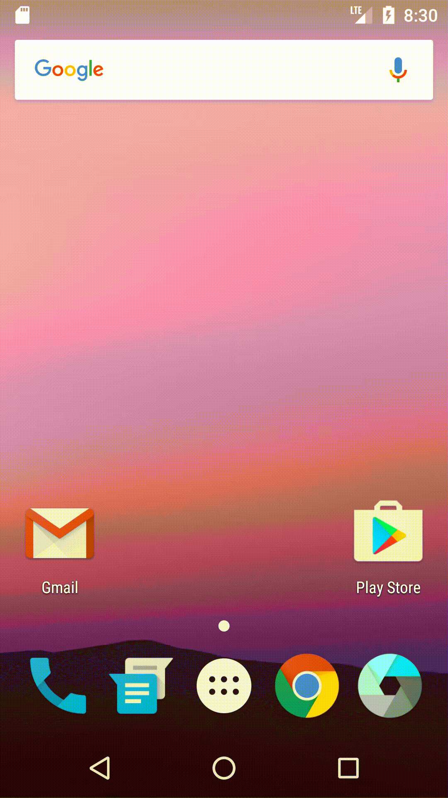

The whole effect:



1.adding the new icon to the application

AndroidManifest.xml

```
android:icon="@mipmap/weather"
```


2.adding the blue background

blueround.xml

`<?xml version="1.0" encoding="utf-8"?>`  
`<shape`  

```
    xmlns:android="http://schemas.android.com/apk/res/android"  
    android:shape="oval"  
    android:useLevel="false">  
  
<!-- 实心 -->  
<solid android:color="#00bfff" />  
<!-- 圆角 -->  
<corners android:radius="360dp" />  
<!-- 边距 -->  
<padding  
    android:bottom="1dp"  
    android:left="1dp"  
    android:right="1dp"  
    android:top="1dp" />  
  
<!-- 大小 -->  
<size android:width="48dp"  
      android:height="48dp" />  
```

`</shape>` 

activity_main.xml

```
<TextView
    android:layout_width="wrap_content"
    android:layout_height="wrap_content"
    android:gravity="center"
    android:background="@drawable/blueround"
    android:text="mon"
    android:textAllCaps="true"
    android:textColor="#909090" />
```


3.adding the refresh button

I used an imagebutton.


4.when the refresh button is pressed, the temperature, the date and the day of the week are all updated.

ImageButton

```
<ImageButton
    android:id="@+id/refreshButton"
    android:layout_width="wrap_content"
    android:layout_height="wrap_content"
    android:layout_alignParentLeft="true"
    android:layout_alignParentStart="true"
    android:layout_below="@+id/textView"
    android:layout_marginLeft="97dp"
    android:layout_marginStart="97dp"
    android:layout_marginTop="28dp"
    android:onClick="btnRefresh"
    app:srcCompat="@drawable/refresh" />
```

function btnRefresh

```
public void btnRefresh(View view) {
    new DownloadUpdate().execute();
    ((TextView)findViewById(R.id.tv_date)).setText(getTime());
    ((TextView)findViewById(R.id.weekView)).setText(getWeek());
}
```

function getTime

```
public String getTime(){
    final Calendar c = Calendar.getInstance();
    c.setTimeZone(TimeZone.getTimeZone("GMT+8:00"));
    String mYear = String.valueOf(c.get(Calendar.YEAR)); // 获取当前年份
    String mMonth = String.valueOf(c.get(Calendar.MONTH) + 1);// 获取当前月份
    String mDay = String.valueOf(c.get(Calendar.DAY_OF_MONTH));// 获取当前月份的日期号
    String mHour = String.valueOf(c.get(Calendar.HOUR_OF_DAY));//时
    String mMinute = String.valueOf(c.get(Calendar.MINUTE));//分
    String mSecond = String.valueOf(c.get(Calendar.SECOND));//秒

    return mMonth +"/"+ mDay+"/"+mYear;
}
```

function getWeek

```
public String getWeek(){
    final Calendar c = Calendar.getInstance();
    c.setTimeZone(TimeZone.getTimeZone("GMT+8:00"));
    String mWay = String.valueOf(c.get(Calendar.DAY_OF_WEEK));
    if("1".equals(mWay)){
        return "SUNDAY";
    }else if("2".equals(mWay)){
        return "MONDAY";
    }else if("3".equals(mWay)){
        return "TUESDAY";
    }else if("4".equals(mWay)){
        return "WEDNESDAY";
    }else if("5".equals(mWay)){
        return "THURSDAY";
    }else if("6".equals(mWay)){
        return "FRIDAY";
    }else if("7".equals(mWay)){
        return "SATURDAY";
    }
    return mWay;
}
```


